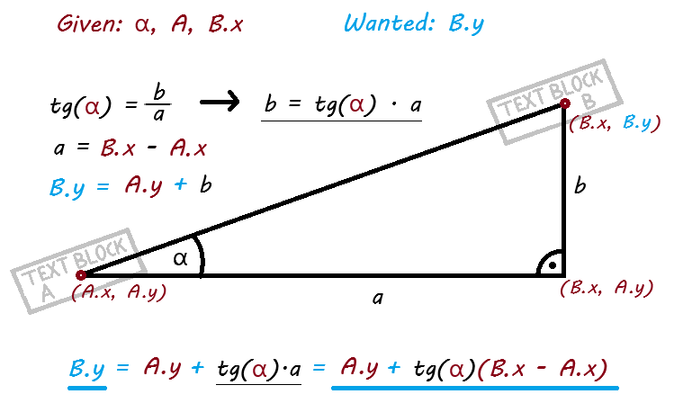

<p align="center">
 
</p>

# Save Receipt

**Save Receipt** is a comprehensive mobile application designed to digitize, parse, and organize physical receipts. By leveraging Optical Character Recognition (OCR) and custom data parsing algorithms, it transforms static images into structured, searchable data.

This project serves as both a fully functional utility for end-users and a demonstration of mobile software architecture, geometric algorithm implementation, and local data persistence.

---

## Product Overview

The core problem with physical receipts is that they are difficult to search and degrade over time. Save Receipt solves this by extracting specific entities—product names, prices, and transaction dates—allowing users to analyze their spending without manual entry.

### Key Features

#### 1. Smart Receipt Creation
Users can digitize receipts through three methods:
*   **Google Document Scanner:** Integrated for high-quality, perspective-corrected scans.
*   **Gallery Import:** Processing existing images from the device.
*   **Manual Entry:** For quick logging without images.

<p align="center">

&nbsp;&nbsp;&nbsp;&nbsp;

</p>

#### 2. Advanced Data Editor
OCR is rarely perfect. To address this, the application includes a sophisticated editor that acts as a correction layer between the raw OCR output and the database.
*   **Granular Control:** Users can drag items between the "Products" and "Info" lists.
*   **Type Reassignment:** Easily convert a text string into a Price, Date, or Product Name.
*   **Data Validation:** The app automatically validates input formats (e.g., currency formats, timestamps).

<p align="center">

</p>

#### 3. Search and Organization
Once saved, receipts are indexed locally. Users can search for specific products across all receipts, making it easy to track warranty items or price changes over time.

#### 4. Document Enhancement
For low-contrast images, the application includes a "Document Mode" that algorithmically sharpens text and increases contrast for better readability.

<p align="center">

</p>

---

## Technical Implementation

This project highlights engineering solutions to common challenges in OCR post-processing and mobile architecture.

### 1. Geometric Text Line Reconstruction
One of the significant challenges with OCR engines (like ML Kit) is that they often return text in scattered blocks rather than coherent lines, especially when the image is skewed.

To solve this, I implemented a custom **Trigonometric Line Alignment Algorithm**.

**The Solution:**
The algorithm calculates the projected trajectory of a text block based on its rotation angle. By using the center point of a "Left" block (`A`) and its rotation angle (`α`), we calculate the expected `Y-coordinate` of a potential "Right" block (`B`) using the tangent function.

<p align="center">  </p>

*From `lib/core/utils/coordinates.dart`:*
```dart
// Calculating the expected Y-coordinate of a neighbor block based on rotation
VerticalMargin.calc(final double rotate, final Offset a, final double x, {final err = 10.0}) {
  double angle = rotate * (pi / 180);
  double tangens = tan(angle);
  
  // Calculate vertical offset based on horizontal distance and angle
  double countedY = a.dy + (tangens * (x - a.dx).abs());
  
  bottom = countedY - err;
  top = countedY + err;
}
```

In this code we have:
- `double rotate` that represents `rotation angle α`,
- `Offset a` that represents block `A` coords,
- `double x` that represents `B.x`

This ensures that prices are correctly associated with product names even if the receipt was photographed at an angle.

### 2. Custom Image Processing
To implement the "Document Mode" visualization, the application performs direct image manipulation using convolution matrices.
*   **Grayscale Conversion:** Reduces channel complexity.
*   **Contrast Adjustment:** Normalizes lighting conditions.
*   **Convolution Filtering:** A 3x3 sharpening kernel is applied to enhance edge detection, making faded text legible.

### 3. Architecture and Persistence
The application follows a **Clean Architecture** approach to ensure scalability and testability:
*   **Data Layer:** Utilizes SQLite (`sqflite`) with dedicated **Data Access Objects (DAOs)**. This abstracts raw SQL queries from the repository logic.
*   **Domain Layer:** Contains pure Dart entities representing the business logic, independent of Flutter dependencies.
*   **Presentation Layer:** Implemented using **GetX** for reactive state management and dependency injection.

### 4. Data Parsing Logic
Raw text is processed through a parsing engine (`DataParser`) that utilizes Regex patterns to categorize strings. The system differentiates between:
*   **Prices:** Handles different decimal separators (comma vs. dot) and currency symbols.
*   **Timestamps:** Parses various date formats (ISO, EU, US standards).
*   **Noise:** Filters out irrelevant OCR artifacts.

---

## Tech Stack

*   **Language:** Dart
*   **Framework:** Flutter
*   **Database:** SQLite
*   **OCR Engine:** Google ML Kit
*   **State Management:** GetX
*   **Image Manipulation:** `image` package (byte-level processing)

## Installation

1.  Clone the repository.
2.  Run `flutter pub get` to install dependencies.
3.  Run `flutter run` to start the application on your emulator or physical device.

```bash
git clone https://github.com/bsobocki/save_receipt.git
cd save_receipt
flutter run
```